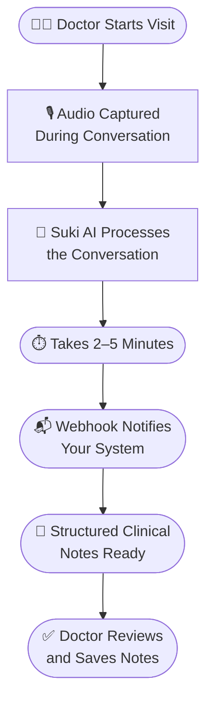

# Ambient Session API Documentation

> Clean and structured documentation for the Ambient Session API — for developers and clinical teams.

---

## 🌐 Live Documentation

👉 [View Live Documentation](https://ambient-session-api-docs.vercel.app/)

---

## 🎯 What Is This Project?

This project is a technical writing assignment that converts raw, unstructured API product notes into clean, structured developer documentation.

The **Ambient Session API** is an AI-powered tool built by **Suki Health** that listens to doctor-patient conversations and automatically generates structured clinical notes — so doctors can focus on patients instead of paperwork.

---

## 🏥 How Suki Health Uses AI



**Before Suki AI:**
- Doctor talks to patient
- Doctor types notes manually after visit
- Takes 1–2 hours of extra work daily

**After Suki AI:**
- Doctor talks to patient
- AI listens and generates notes automatically
- Doctor just reviews and saves — done in minutes

---

## 📋 Assignment Requirements

This documentation covers all 9 required sections:

| # | Requirement | Status | Page |
|---|---|---|---|
| 1 | Clear title and overview | ✅ Done | [Overview](docs/overview.md) |
| 2 | Authentication section | ✅ Done | [Authentication](docs/authentication.md) |
| 3 | Endpoint details | ✅ Done | [Endpoints](docs/endpoints.md) |
| 4 | Request body with JSON | ✅ Done | [Endpoints](docs/endpoints.md) |
| 5 | Response examples | ✅ Done | [Response Examples](docs/response-examples.md) |
| 6 | Parameter explanations | ✅ Done | [Endpoints](docs/endpoints.md) |
| 7 | Webhook explanation | ✅ Done | [Webhooks](docs/webhooks.md) |
| 8 | Example usage | ✅ Done | [Endpoints](docs/endpoints.md) + [Webhooks](docs/webhooks.md) |
| 9 | Best practices | ✅ Done | [Best Practices](docs/best-practices.md) |

---

## 📁 What's Inside

| File | Description |
|---|---|
| [Overview](docs/overview.md) | What the API is and how it works |
| [Authentication](docs/authentication.md) | How to authenticate your requests |
| [Endpoints](docs/endpoints.md) | API endpoint, request body, parameters |
| [Response Examples](docs/response-examples.md) | Success and error response examples |
| [Webhooks](docs/webhooks.md) | Webhook setup and payload details |
| [Best Practices](docs/best-practices.md) | Async workflow, timing, and tips |
| [AI Usage](AI-Usage.md) | AI tools used and reasoning |
| [My Response](My_Response.md) | Technical writer Slack response |

---

## 🚀 Quick Start

```bash
# Clone the repository
git clone https://github.com/poornimajoshi90/ambient-session-api-docs

# Install dependencies
cd ambient-session-api-docs
npm install

# Run locally
npm run start
```

---

## 🛠️ Built With

- [Docusaurus](https://docusaurus.io/) — Documentation framework
- [Mermaid](https://mermaid.js.org/) — Workflow diagrams
- Markdown — Content

---


*Documentation created as part of a technical writing assignment.*
