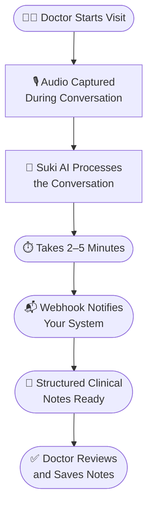

# Ambient Session API Documentation

> Clean and structured documentation for the Ambient Session API — for developers and clinical teams.

---

## 🌐 Live Documentation

👉 [View Live Documentation](https://ambient-session-api-docs.vercel.app/)

---

## 🎯 About This Assignment

This documentation was created as part of a technical writing assignment received from Suki.ai.

The goal was to convert raw, unstructured API product notes into clean, structured documentation that is easy to understand for both developers and clinical teams.

---

### 🩺 About Suki.ai

**Suki.ai** is a healthcare technology company that builds AI-powered voice assistants and digital solutions for the healthcare sector.

Its main goal is to reduce the administrative burden on doctors and clinical staff — such as writing medical notes and documenting patient data — so they can spend more time with patients and less time on paperwork.

The **Ambient Session API** is one of Suki's core AI solutions. It listens to doctor-patient conversations during a visit and automatically generates structured clinical notes — without the doctor having to type anything.

**The impact:**

| Before Suki AI | After Suki AI |
|---|---|
| Doctor types notes manually after every visit | AI listens and generates notes automatically |
| 1–2 hours of extra paperwork daily | Doctor just reviews and saves — done in minutes |
| Less time with patients | More time with patients |
| Higher burnout risk | Reduced administrative stress |

---

## 🏥 How Suki.ai Works




## 📋 Assignment Requirements

This documentation covers all 9 required sections:

| # | Requirement | Status | Page |
|---|---|---|---|
| 1 | Clear title and overview | ✅ Done | [Overview](docs/overview.md) |
| 2 | Authentication section | ✅ Done | [Authentication](docs/authentication.md) |
| 3 | Endpoint details | ✅ Done | [Endpoints](docs/endpoints.md) |
| 4 | Request body with JSON | ✅ Done | [Endpoints](docs/endpoints.md) |
| 5 | Response examples | ✅ Done | [Response Examples](docs/response-examples.md) |
| 6 | Parameter explanations | ✅ Done | [Endpoints](docs/endpoints.md) |
| 7 | Webhook explanation | ✅ Done | [Webhooks](docs/webhooks.md) |
| 8 | Example usage | ✅ Done | [Endpoints](docs/endpoints.md) + [Webhooks](docs/webhooks.md) |
| 9 | Best practices | ✅ Done | [Best Practices](docs/best-practices.md) |

---

## 📁 What's Inside

| File | Description |
|---|---|
| [Overview](docs/overview.md) | What the API is and how it works |
| [Authentication](docs/authentication.md) | How to authenticate your requests |
| [Endpoints](docs/endpoints.md) | API endpoint, request body, parameters |
| [Response Examples](docs/response-examples.md) | Success and error response examples |
| [Webhooks](docs/webhooks.md) | Webhook setup and payload details |
| [Best Practices](docs/best-practices.md) | Async workflow, timing, and tips |
| [AI Usage](AI-Usage.md) | AI tools used and reasoning |
| [My Response](My_Response) | Technical writer Slack response |

---

## 🚀 Quick Start

```bash
# Clone the repository
git clone https://github.com/poornimajoshi90/ambient-session-api-docs

# Install dependencies
cd ambient-session-api-docs
npm install

# Run locally
npm run start
```

---

## 🛠️ Built With

- [Docusaurus](https://docusaurus.io/) — Documentation framework
- [Mermaid](https://mermaid.js.org/) — Workflow diagrams
- Markdown — Content

---


*Documentation created as part of a technical writing assignment.*
