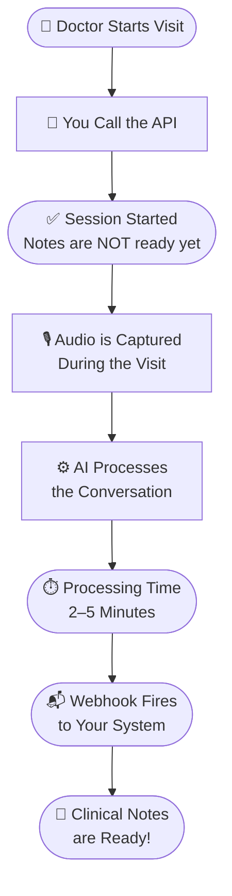

# Overview

> 
> 
> 
  

## What Is This API?

The Ambient Session API records a doctor-patient conversation and turns it into structured clinical notes — automatically.

You start a session, audio gets captured, and within a few minutes the notes are ready.

Built for developers integrating ambient AI into:

- EHR (Electronic Health Record) systems
- Telehealth platforms
- Clinical workflow tools

---

## Important — Read This First

:::caution
**The API works in the background.**
Starting a session does **not** mean the notes are ready.
Notes take **2–5 minutes** after the session ends.
You will get a **webhook notification** when done.
:::

---

## How It Works

### Step by Step

```
1. You call the API  →  Session starts
2. Doctor talks      →  Audio is captured
3. AI processes      →  Takes 2–5 minutes
4. Webhook fires     →  Notes are ready
5. You fetch notes   →  Done
```

### Workflow Diagram



### Timeline

| Step               | Time                        |
| ------------------ | --------------------------- |
| Session starts     | < 1 second                  |
| AI processes notes | 2–5 minutes                 |
| Webhook fires      | Right after notes are ready |

---

## What This API Does NOT Do

:::danger
Don't assume these

- ❌ **Does not record audio** — your app or device handles that
- ❌ **Does not return notes instantly** — notes take 2–5 minutes
- ❌ **Does not allow duplicate sessions** — one session per visit only
  :::

---

## Next Steps

| I want to…             | Go to…                               |
| ---------------------- | ------------------------------------ |
| Set up auth            | [Authentication →](authentication)   |
| Make my first API call | [Endpoint →](endpoints)              |
| Get notified when done | [Webhooks →](webhooks)               |
| See code examples      | [Example Usage →](response-examples) |
| Avoid common mistakes  | [Best Practices →](best-practices)   |

---
